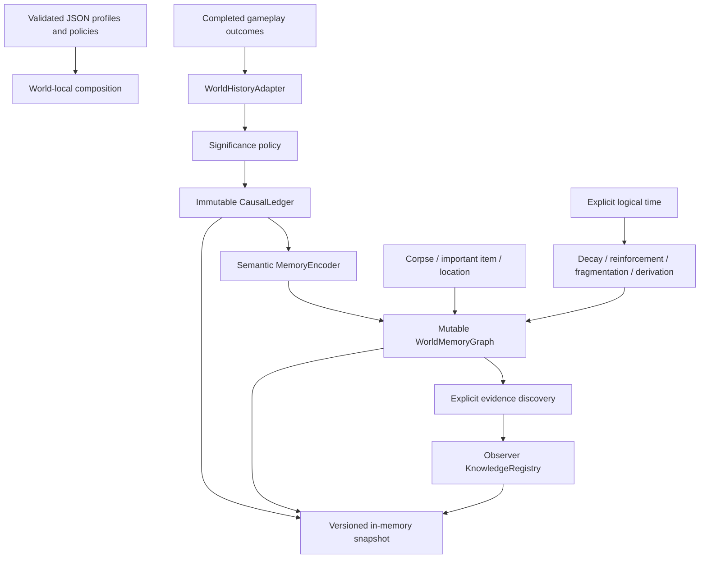

# World Memory Foundation — Phase 28 integration

Implemented against baseline `cde8f61b63065274c1c94c825286a17cad6ac637`
in `D:/Codex-Projects/codex-game`. The supplied Phase 13 brief is preserved in
[WORLD_MEMORY_FOUNDATION.md](WORLD_MEMORY_FOUNDATION.md); the pre-change audit
is in [WORLD_MEMORY_AUDIT.md](WORLD_MEMORY_AUDIT.md).

## Relationship to the current project

WM-0 through WM-5 establish an additional foundation beside completed bounded
Phases 0–28. WM-6 has an observer-record boundary, without NPC society or rumors.
Phases 29–32 still own save files, player/world restoration and chunk streaming.
No gameplay phase is renumbered and no models, animations or combat balance
were changed by this work. Existing uncommitted interaction/presentation work
was retained; it is not attributed to this architecture change.



Gameplay components emit completed results and retain their current duties.
Only DemoWorld composes the adapter. Inventory exposes a post-commit drop
signal; inventory, health, wounds, weapons and lifecycle do not import memory
internals. The adapter reads GameClock; records do not own a clock or timer.

## Implemented contracts

- **CausalLedger:** structured append-only events with stable identities,
  logical time, physical depth, location, participants, objects, facts and
  explicit prior causes. Accepted records are detached and frozen internally.
  Actor/object/location/cause/effect queries have deterministic order.
- **WorldMemoryGraph:** separately owned claims, nodes, edges and anchors.
  Each claim tracks clarity, retention, confidence, accessibility and fragment
  state. Multiple memories may describe one event; anchors may support several
  memories. Links and source events are validated transactionally.
- **Anchors:** stable physical target references, media profile, durability,
  readability, accessibility, exposure and last known location. Removing a
  scene node hides evidence; explicit physical destruction invalidates it.
  Inaccessible surviving evidence is dormant and can be rediscovered.
- **MemoryLifecycle:** exponential logical-time decay uses the best surviving
  medium and exposure, with reinforcement reducing decay. Calls at the same
  timestamp are idempotent; backward time is rejected. Fragmentation operates
  on claims and preserves semantic residue. Seeded derivation creates a new
  version and source edge instead of rewriting the original or the ledger.
- **Reinforcement:** exposure grants no gain; meaningful access is deduplicated
  by observer and physical target across access kinds. Independent sources can
  contribute; archive/recording weights differ from inspection. Reinforcement
  may strengthen an incorrect interpretation and never implies truth accuracy.
- **KnowledgeRegistry:** only explicit observation creates observer-local
  beliefs. Records hold a believed value, confidence and source memory/claim;
  no canonical accuracy field or direct ledger dependency is exposed.
- **WorldHistoryRuntime:** a world-local RefCounted composition root with
  versioned JSON-compatible snapshots and atomic cross-layer restoration.
  A failed encoding leaves a valid accepted historical event intact while
  publishing no partial memory. A failed restore preserves the previous world.

The policy initially accepts configured `historical` / `landmark` outcomes.
Unknown, trivial and local-only outcomes are ignored by this recorder.
Local-only traces remain a later extension; no every-hit or every-tick log exists.

## Gameplay integration

| Current subsystem | Added behavior |
|---|---|
| CreatureDeathComponent `corpse_spawned` | After successful transition, record character death and bind corpse/location evidence |
| PlayerDefeatComponent `defeated` | Record character defeat; preserve existing shutdown and inventory |
| WoundComponent `wound_created` | At configured severity, record major wound and severe bleeding with the wound event as cause |
| Important carried ItemInstance | Use the existing UUID as target identity; no history fields in item definitions or instance records |
| PlayerInventory pickup/drop | Update existing evidence location and accessibility after transfer succeeds; ordinary transfers create no historical events |
| Corpse inspection | Explicitly discover its evidence for the current demo player; no automatically global character biography |
| Scene unload/removal | Hide the removed physical target; keep history and anchor existence |
| `notify_anchor_destroyed(kind, id)` | Invalidate physical evidence only when an owning simulation confirms destruction |
| `bind_restored_identity(node, id)` | Rebind known actor/corpse identities, reject duplicate live bindings, restore surviving corpse access without a new death |

The current demo is a surface world: `absolute_depth_m = 0`, area `surface`.
Canonical locations can independently carry `ecological_region_id` and
`world_epoch`, with 2D or 3D coordinates. Physical depth is never inferred from
ecological age. Later world services should supply actual regions/depth.

Existing depletion signals do **not** provide confirmed cause attribution.
Automatic death/defeat records therefore use cause `unknown`, with no invented
wound-to-death link. Severe wound → bleeding is supported by the actual wound
signal. Tests use explicit confirmed blood-loss events to exercise the complete
wound → bleeding → death → corpse/knife → dormant → rediscovery vertical slice.

## Files added or modified by this work

New runtime scripts:

- `game/scripts/history/{record_validation,historical_event,causal_ledger,world_history_runtime,world_history_adapter}.gd`
- `game/scripts/memory/{memory_config,memory_claim,memory_node,memory_edge,memory_anchor_ref,world_memory_graph,memory_encoder,memory_lifecycle,knowledge_registry}.gd`
- `game/data/world_memory/{memory_retention_profiles,memory_event_policies}.json`

New tests:

- `game/tests/unit/history/history_fixture.gd`
- `game/tests/unit/history/test_causal_ledger.gd`
- `game/tests/unit/history/test_world_history_runtime.gd`
- `game/tests/unit/history/test_world_history_integration.gd`
- `game/tests/unit/memory/test_memory_graph.gd`
- `game/tests/unit/memory/test_memory_lifecycle.gd`

Existing production edits are limited to:

- `game/scripts/world/demo_world.gd`: world-local composition at startup.
- `game/scripts/player/player_inventory_component.gd`: successful-drop signal.

Documentation: this integration report, preserved brief, audit, and appended
sections in `ARCHITECTURE.md`, `ROADMAP.md`, `SAVE_FORMAT.md`, `CHANGELOG.md`.
Baseline diff, status and regression logs reside in `builds/world_memory/`.

## Acceptance mapping

| Brief criterion | Evidence |
|---|---|
| 1–2 Immutable structured truth; separate memory | CausalLedger mutation isolation and independent graph tests |
| 3–4 Decay and claim fragmentation | MemoryLifecycle truth isolation, detail removal and semantic residue tests |
| 5–8 Multiple anchors; destruction; dormancy; rediscovery | MemoryGraph plus explicit relic vertical slice |
| 9–10 Independent reinforcement; confidence ≠ accuracy | Deduplicated inspection and stronger archive of a distorted interpretation |
| 11–12 Contradictions and provenance | Derived conflicting value coexists with source; source IDs/edge retained; cycles rejected |
| 13 Existing systems independent | Only two production integration edits; no memory imports in health, inventory logic or lifecycle |
| 14–15 Existing and new tests | Entire current Phase 0–28 regression, plus five new suites |
| 16 No inactive per-frame simulation | Record/services extend RefCounted; no `_process` in history/memory |
| 17 Stable identities | Item UUIDs and allocator-backed actor/corpse IDs; ephemeral connection keys never serialized |
| 18 Deterministic round-trip | Ledger, graph and full runtime JSON restore tests |
| 19 Failure isolation | Invalid cause, duplicate IDs, missing claims, malformed types/provenance and cross-layer restore rollback |
| 20 Future persistence/ecology | Versioned snapshot, restoration binding, extensible location/anchor types; no ecology ownership |

## Verification

The original 39 Godot suites passed before implementation. Final verification
on 2026-10-04 passed all 44 suites and 2,655 checks using Godot 4.7.2 console
(the five new suites contribute 124 checks). Detailed totals and the empty
failed-script list are in `builds/world_memory/validation-summary.json`.
Python's 25 existing tool tests passed; JSON, ID/schema and reference validators
passed. The launch scene also completed a 240-frame headless smoke run with
seven zombies. Scene re-entry is covered without duplicate result connections.

Commands, from the repository root:

```powershell
& 'E:\Godot_v4.7.2-stable_win64.exe\Godot_v4.7.2-stable_win64_console.exe' --headless --path game --script res://tests/unit/history/test_world_history_runtime.gd
python -m unittest discover -s tools/tests
python tools/validate_json.py
python tools/validate_ids.py
python tools/validate_references.py
```

The existing Python schema/reference validator covers existing core data
groups. Memory-specific validation is performed by MemoryConfig and adapter
item-reference checks, exercised by the new Godot suites; `validate_json.py`
also scans the new JSON files.

## Limits and next integration points

- Snapshots are in-memory records, not save slots or disk persistence. Future
  save code must persist actor/corpse binding metadata together with gameplay
  state and restore GameClock consistently before querying memory.
- Queries do not implicitly advance time. Call `lifecycle.advance(graph, now)`
  on a controlled batch or before discovery. This supports unloaded worlds
  without allocating timers or nodes per record.
- Graph transactions currently clone and validate the bounded graph. Indexes
  accelerate reads; future large worlds need changed-record transactions,
  retention limits and streaming indexes before stress claims can be made.
- Corpse inspection uses the one current demo player because its existing
  signal carries no interacting observer. Multiple observers need an explicit
  observer-bearing interaction result API before automatic NPC knowledge.
- Reinforcement source sets are serialized and unbounded in this foundation;
  long-lived worlds need a data-driven retention/compaction policy.
- Decay, fragmentation and distortion are exposed services, not new UI flows.
  Durable semantic residue decays too; inaccessible surviving media can remain
  dormant. Destroying the last medium makes the memory lost but keeps history.
- No full save manager, corpse looting, corpse decomposition, ecology,
  geological simulation, society, rumors, biography generation or LLM canon
  was introduced. These remain owners/consumers of the established boundaries.
